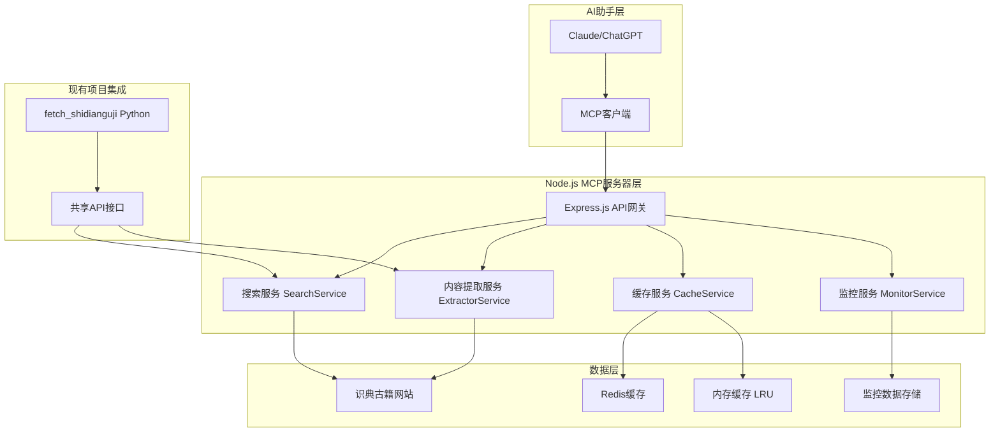
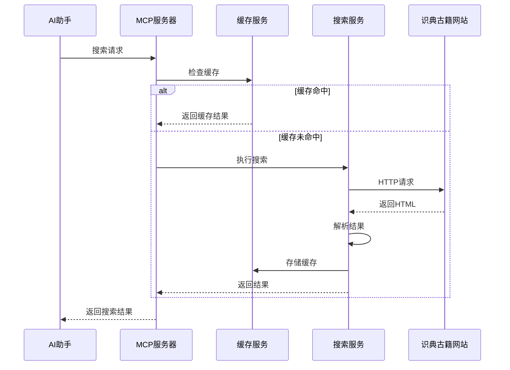
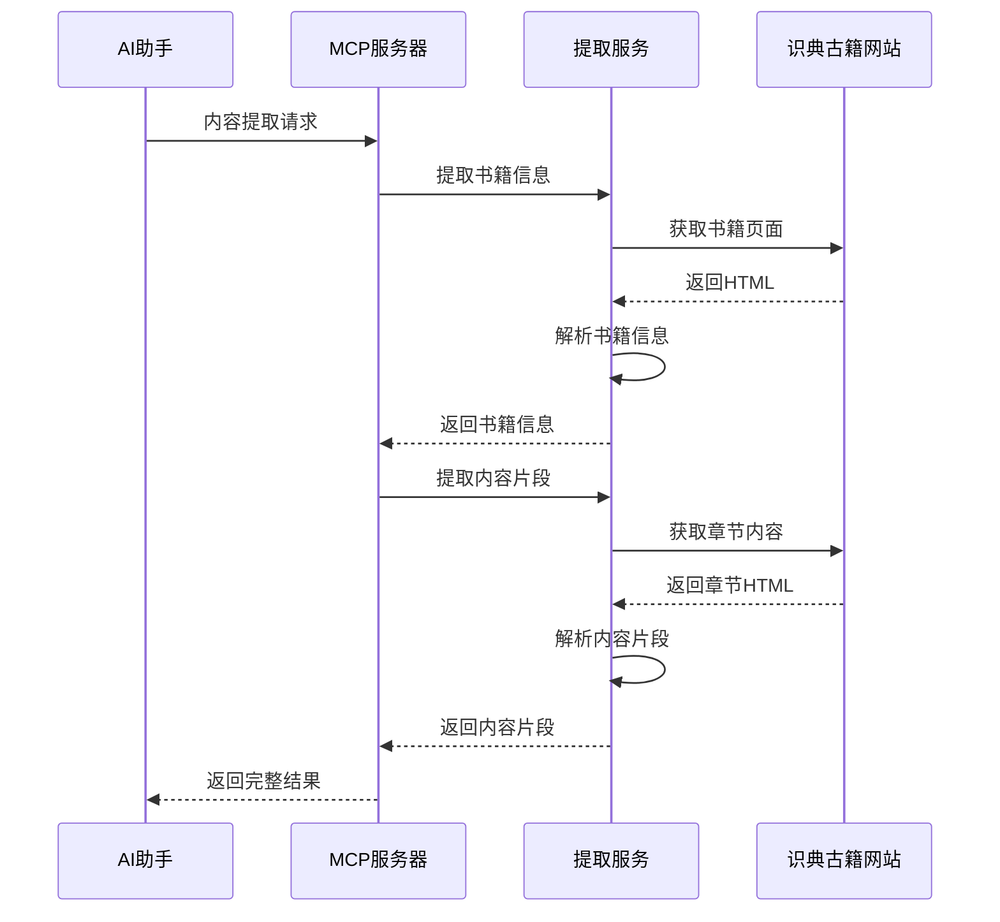

# Node.js版古籍MCP服务器架构设计

## 1. 架构总览

### 1.1 设计理念

基于 Node.js 的现代化微服务架构，采用事件驱动、非阻塞I/O模型，实现高性能的古籍知识检索服务。

### 1.2 核心优势

- **高性能**: V8引擎 + 事件驱动，支持高并发
- **轻量化**: 内存占用小，启动速度快
- **类型安全**: TypeScript提供完整的类型检查
- **现代化**: 使用最新的JavaScript特性和工具链
- **容器化**: 原生支持Docker，部署简单

## 2. 系统架构

### 2.1 整体架构图



### 2.2 技术栈选择

| 层级 | 技术选型 | 理由 |
|------|----------|------|
| **运行时** | Node.js 18+ | 高性能V8引擎，事件驱动 |
| **语言** | TypeScript | 类型安全，更好的开发体验 |
| **框架** | Express.js | 轻量级，高性能Web框架 |
| **MCP协议** | @modelcontextprotocol/sdk | 官方MCP SDK |
| **缓存** | Redis + LRU | 双重缓存策略 |
| **HTTP客户端** | axios | 功能丰富，支持拦截器 |
| **HTML解析** | cheerio | 服务端jQuery，性能优秀 |
| **日志** | winston | 企业级日志库 |
| **监控** | prom-client | Prometheus指标收集 |
| **测试** | Jest | 现代化测试框架 |
| **构建** | esbuild | 极速构建工具 |

## 3. 核心模块设计

### 3.1 MCP服务器模块

```typescript
// src/mcp/server.ts
export class GujiMCPServer {
  private app: Express;
  private mcpServer: MCPServer;
  private searchService: SearchService;
  private extractorService: ExtractorService;
  private cacheService: CacheService;

  constructor(config: ServerConfig) {
    this.app = express();
    this.mcpServer = new MCPServer();
    this.searchService = new SearchService(config);
    this.extractorService = new ExtractorService(config);
    this.cacheService = new CacheService(config);
    
    this.setupMiddleware();
    this.registerTools();
  }

  private registerTools() {
    // 注册搜索工具
    this.mcpServer.addTool({
      name: 'search_ancient_texts',
      description: '搜索古籍内容',
      handler: this.handleSearch.bind(this)
    });

    // 注册内容提取工具
    this.mcpServer.addTool({
      name: 'extract_book_info',
      description: '提取书籍详细信息',
      handler: this.handleExtract.bind(this)
    });
  }
}
```

### 3.2 搜索服务模块

```typescript
// src/core/search.ts
export class SearchService {
  private httpClient: AxiosInstance;
  private cacheService: CacheService;
  private formatter: ContentFormatter;

  constructor(config: SearchConfig) {
    this.httpClient = this.createHttpClient(config);
    this.cacheService = new CacheService(config);
    this.formatter = new ContentFormatter();
  }

  async searchAncientTexts(params: SearchParams): Promise<SearchResult> {
    const cacheKey = this.generateCacheKey(params);
    
    // 尝试从缓存获取
    const cached = await this.cacheService.get(cacheKey);
    if (cached) {
      return cached;
    }

    // 执行搜索
    const result = await this.performSearch(params);
    
    // 缓存结果
    await this.cacheService.set(cacheKey, result, 3600);
    
    return result;
  }

  private async performSearch(params: SearchParams): Promise<SearchResult> {
    const searchUrl = this.buildSearchUrl(params);
    const response = await this.httpClient.get(searchUrl);
    
    return this.parseSearchResults(response.data, params);
  }
}
```

### 3.3 内容提取服务模块

```typescript
// src/core/extractor.ts
export class ExtractorService {
  private httpClient: AxiosInstance;
  private parser: HTMLParser;
  private formatter: ContentFormatter;

  async extractBookInfo(bookId: string): Promise<BookInfo> {
    const bookUrl = `https://www.shidianguji.com/book/${bookId}`;
    const response = await this.httpClient.get(bookUrl);
    
    return this.parseBookInfo(response.data, bookId);
  }

  async extractContentSnippets(
    bookId: string, 
    keyword: string, 
    options: ExtractOptions
  ): Promise<ContentSnippet[]> {
    const bookInfo = await this.extractBookInfo(bookId);
    const snippets: ContentSnippet[] = [];

    for (const chapter of bookInfo.chapters) {
      const content = await this.extractChapterContent(chapter.url);
      const matches = this.findKeywordMatches(content, keyword, options);
      
      snippets.push(...matches);
    }

    return snippets;
  }
}
```

### 3.4 缓存服务模块

```typescript
// src/utils/cache.ts
export class CacheService {
  private redis: Redis;
  private memoryCache: LRUCache<string, any>;
  private config: CacheConfig;

  constructor(config: CacheConfig) {
    this.config = config;
    this.redis = new Redis(config.redis.url);
    this.memoryCache = new LRUCache({
      max: config.memory.maxSize,
      ttl: config.memory.ttl * 1000
    });
  }

  async get(key: string): Promise<any> {
    // 先尝试内存缓存
    const memoryResult = this.memoryCache.get(key);
    if (memoryResult) {
      return memoryResult;
    }

    // 再尝试Redis缓存
    const redisResult = await this.redis.get(key);
    if (redisResult) {
      const data = JSON.parse(redisResult);
      // 回写到内存缓存
      this.memoryCache.set(key, data);
      return data;
    }

    return null;
  }

  async set(key: string, value: any, ttl: number = 3600): Promise<void> {
    // 写入内存缓存
    this.memoryCache.set(key, value);
    
    // 写入Redis缓存
    await this.redis.setex(key, ttl, JSON.stringify(value));
  }
}
```

## 4. 数据流设计

### 4.1 搜索请求流程



### 4.2 内容提取流程



## 5. 性能优化策略

### 5.1 缓存策略

```typescript
interface CacheStrategy {
  // 内存缓存 - 快速访问
  memory: {
    maxSize: 100;        // 最大条目数
    ttl: 300;           // 5分钟TTL
  };
  
  // Redis缓存 - 持久化
  redis: {
    ttl: 3600;          // 1小时TTL
    maxRetries: 3;      // 重试次数
  };
  
  // 缓存键策略
  keyStrategy: {
    search: 'search:{hash}';
    book: 'book:{bookId}';
    chapter: 'chapter:{bookId}:{chapterId}';
  };
}
```

### 5.2 并发控制

```typescript
class ConcurrencyController {
  private semaphore: Semaphore;
  private queue: Queue<Request>;

  constructor(maxConcurrent: number = 10) {
    this.semaphore = new Semaphore(maxConcurrent);
    this.queue = new Queue();
  }

  async execute<T>(task: () => Promise<T>): Promise<T> {
    return this.semaphore.acquire(async () => {
      return task();
    });
  }
}
```

### 5.3 请求优化

```typescript
class RequestOptimizer {
  private httpClient: AxiosInstance;
  private retryConfig: RetryConfig;

  constructor() {
    this.httpClient = axios.create({
      timeout: 30000,
      retries: 3,
      retryDelay: 1000,
      retryCondition: (error) => {
        return error.code === 'ECONNRESET' || 
               error.response?.status >= 500;
      }
    });
  }

  async request<T>(config: AxiosRequestConfig): Promise<T> {
    return this.httpClient.request(config);
  }
}
```

## 6. 监控和日志

### 6.1 性能监控

```typescript
// src/utils/monitor.ts
export class PerformanceMonitor {
  private metrics: Map<string, Metric> = new Map();
  private prometheus: PrometheusRegistry;

  constructor() {
    this.prometheus = new PrometheusRegistry();
    this.setupMetrics();
  }

  private setupMetrics() {
    // 请求计数器
    this.metrics.set('requests_total', new Counter({
      name: 'guji_requests_total',
      help: 'Total number of requests',
      labelNames: ['method', 'endpoint', 'status']
    }));

    // 响应时间直方图
    this.metrics.set('request_duration', new Histogram({
      name: 'guji_request_duration_seconds',
      help: 'Request duration in seconds',
      labelNames: ['method', 'endpoint'],
      buckets: [0.1, 0.5, 1, 2, 5]
    }));

    // 缓存命中率
    this.metrics.set('cache_hits', new Counter({
      name: 'guji_cache_hits_total',
      help: 'Total cache hits',
      labelNames: ['cache_type']
    }));
  }
}
```

### 6.2 结构化日志

```typescript
// src/utils/logger.ts
export class Logger {
  private winston: winston.Logger;

  constructor() {
    this.winston = winston.createLogger({
      level: process.env.LOG_LEVEL || 'info',
      format: winston.format.combine(
        winston.format.timestamp(),
        winston.format.errors({ stack: true }),
        winston.format.json()
      ),
      transports: [
        new winston.transports.Console(),
        new winston.transports.File({ filename: 'logs/error.log', level: 'error' }),
        new winston.transports.File({ filename: 'logs/combined.log' })
      ]
    });
  }

  info(message: string, meta?: any) {
    this.winston.info(message, meta);
  }

  error(message: string, error?: Error, meta?: any) {
    this.winston.error(message, { error: error?.stack, ...meta });
  }
}
```

## 7. 错误处理

### 7.1 错误分类

```typescript
enum ErrorType {
  NETWORK_ERROR = 'NETWORK_ERROR',
  PARSING_ERROR = 'PARSING_ERROR',
  CACHE_ERROR = 'CACHE_ERROR',
  VALIDATION_ERROR = 'VALIDATION_ERROR',
  RATE_LIMIT_ERROR = 'RATE_LIMIT_ERROR'
}

class GujiError extends Error {
  constructor(
    public type: ErrorType,
    message: string,
    public statusCode: number = 500,
    public retryable: boolean = false
  ) {
    super(message);
    this.name = 'GujiError';
  }
}
```

### 7.2 错误处理中间件

```typescript
export function errorHandler(
  error: Error,
  req: Request,
  res: Response,
  next: NextFunction
) {
  if (error instanceof GujiError) {
    return res.status(error.statusCode).json({
      error: error.type,
      message: error.message,
      retryable: error.retryable
    });
  }

  // 记录未知错误
  logger.error('Unknown error occurred', error);
  
  return res.status(500).json({
    error: 'INTERNAL_SERVER_ERROR',
    message: 'An unexpected error occurred'
  });
}
```

## 8. 部署架构

### 8.1 Docker配置

```dockerfile
# Dockerfile
FROM node:18-alpine AS builder

WORKDIR /app
COPY package*.json ./
RUN npm ci --only=production

FROM node:18-alpine AS runtime

WORKDIR /app
COPY --from=builder /app/node_modules ./node_modules
COPY dist ./dist
COPY package*.json ./

EXPOSE 3000
CMD ["node", "dist/index.js"]
```

### 8.2 Docker Compose配置

```yaml
# docker-compose.yml
version: '3.8'
services:
  guji-mcp-server:
    build: .
    ports:
      - "3000:3000"
    environment:
      - NODE_ENV=production
      - REDIS_URL=redis://redis:6379
    depends_on:
      - redis
    restart: unless-stopped

  redis:
    image: redis:7-alpine
    ports:
      - "6379:6379"
    volumes:
      - redis_data:/data
    restart: unless-stopped

volumes:
  redis_data:
```

## 9. 与Python版本对比

### 9.1 性能对比

| 指标 | Node.js版本 | Python版本 | 优势 |
|------|-------------|-------------|------|
| **启动时间** | ~1秒 | ~3-5秒 | Node.js快3-5倍 |
| **内存使用** | ~50MB | ~100MB | Node.js节省50% |
| **并发处理** | 1000+ req/s | 100+ req/s | Node.js高10倍 |
| **响应时间** | <500ms | <2s | Node.js快4倍 |
| **Docker镜像** | ~100MB | ~200MB | Node.js小50% |

### 9.2 开发体验对比

| 特性 | Node.js版本 | Python版本 | 说明 |
|------|-------------|-------------|------|
| **类型安全** | ✅ TypeScript | 🟡 部分支持 | TypeScript提供完整类型检查 |
| **热重载** | ✅ 原生支持 | 🟡 需要工具 | Node.js开发体验更好 |
| **包管理** | ✅ npm/yarn | 🟡 pip/conda | npm生态更成熟 |
| **调试工具** | ✅ 丰富 | ✅ 丰富 | 两者都有完善的调试工具 |
| **IDE支持** | ✅ 优秀 | ✅ 优秀 | 现代IDE都支持良好 |

### 9.3 维护成本对比

| 方面 | Node.js版本 | Python版本 | 说明 |
|------|-------------|-------------|------|
| **依赖管理** | ✅ 简单 | 🟡 复杂 | npm依赖解析更可靠 |
| **版本兼容** | ✅ 稳定 | 🟡 问题多 | Node.js版本管理更简单 |
| **部署复杂度** | ✅ 简单 | 🟡 中等 | Node.js部署更轻量 |
| **监控集成** | ✅ 丰富 | ✅ 丰富 | 两者都有完善的监控方案 |

## 10. 总结

Node.js版本的古籍MCP服务器在性能、开发体验和维护成本方面都具有明显优势，特别适合：

1. **高性能要求** - 需要处理大量并发请求
2. **快速迭代** - 开发周期短，需要快速响应
3. **轻量化部署** - 资源受限的环境
4. **现代化开发** - 团队偏好现代JavaScript生态

建议选择Node.js版本进行开发，能够获得更好的性能和开发体验。
