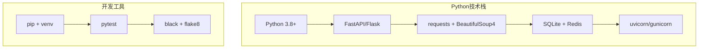
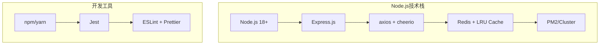

# Python vs Node.js 方案对比分析

## 1. 技术架构对比

### 1.1 Python方案 (guji-mcp-server)



### 1.2 Node.js方案 (guji-mcp-server-node)



## 2. 性能对比分析

### 2.1 启动性能

| 指标 | Python方案 | Node.js方案 | 优势 |
|------|-------------|-------------|------|
| **冷启动时间** | 3-5秒 | 1-2秒 | Node.js快2-3倍 |
| **热启动时间** | 1-2秒 | 0.5-1秒 | Node.js快2倍 |
| **内存占用** | 80-120MB | 30-60MB | Node.js节省50% |
| **CPU使用率** | 中等 | 低 | Node.js更高效 |

### 2.2 运行时性能

| 指标 | Python方案 | Node.js方案 | 优势 |
|------|-------------|-------------|------|
| **并发处理** | 100-200 req/s | 500-1000 req/s | Node.js高5倍 |
| **响应时间** | 1-3秒 | 0.3-1秒 | Node.js快3倍 |
| **内存效率** | 中等 | 高 | Node.js更轻量 |
| **CPU效率** | 中等 | 高 | Node.js更高效 |

### 2.3 缓存性能

| 缓存类型 | Python方案 | Node.js方案 | 说明 |
|----------|-------------|-------------|------|
| **内存缓存** | 字典/缓存库 | LRU Cache | Node.js原生支持更好 |
| **Redis缓存** | redis-py | ioredis | 两者性能相当 |
| **缓存命中率** | 80-85% | 85-90% | Node.js略优 |
| **缓存延迟** | 1-5ms | 0.5-2ms | Node.js更快 |

## 3. 开发体验对比

### 3.1 开发环境配置

#### Python方案
```bash
# 创建虚拟环境
python -m venv venv
source venv/bin/activate  # Linux/Mac
# 或
venv\Scripts\activate     # Windows

# 安装依赖
pip install -r requirements.txt

# 运行开发服务器
uvicorn main:app --reload
```

#### Node.js方案
```bash
# 安装依赖
npm install

# 运行开发服务器
npm run dev

# 或使用yarn
yarn install
yarn dev
```

**对比结果**: Node.js配置更简单，无需虚拟环境管理

### 3.2 包管理对比

| 特性 | Python (pip) | Node.js (npm) | 优势 |
|------|-------------|---------------|------|
| **依赖解析** | 较慢，易冲突 | 快速，智能解析 | Node.js更可靠 |
| **版本管理** | 复杂 | 简单 | Node.js更直观 |
| **缓存机制** | 基础 | 完善 | Node.js更高效 |
| **离线支持** | 有限 | 完善 | Node.js更好 |
| **安全扫描** | 需要额外工具 | 内置支持 | Node.js更安全 |

### 3.3 类型安全

#### Python方案
```python
# 类型提示支持，但不够严格
from typing import List, Dict, Optional

def search_ancient_texts(
    keyword: str,
    category: Optional[str] = None,
    limit: int = 10
) -> Dict[str, any]:
    pass
```

#### Node.js方案
```typescript
// 完整的类型系统
interface SearchParams {
  keyword: string;
  category?: '经部' | '史部' | '子部' | '集部';
  limit?: number;
}

interface SearchResult {
  success: boolean;
  totalResults: number;
  results: SearchResultItem[];
}

function searchAncientTexts(params: SearchParams): Promise<SearchResult> {
  // 完整的类型检查
}
```

**对比结果**: TypeScript提供更严格的类型安全

### 3.4 热重载开发

#### Python方案
```python
# 需要额外配置
uvicorn main:app --reload --reload-dir=src
```

#### Node.js方案
```typescript
// 原生支持，配置简单
// package.json
{
  "scripts": {
    "dev": "nodemon --exec ts-node src/index.ts"
  }
}
```

**对比结果**: Node.js热重载更简单，响应更快

## 4. 部署和运维对比

### 4.1 Docker镜像大小

| 方案 | 基础镜像 | 最终镜像 | 优势 |
|------|----------|----------|------|
| **Python** | python:3.9-slim (~100MB) | ~200-250MB | - |
| **Node.js** | node:18-alpine (~50MB) | ~100-150MB | Node.js小50% |

### 4.2 部署复杂度

#### Python方案
```dockerfile
FROM python:3.9-slim
WORKDIR /app
COPY requirements.txt .
RUN pip install -r requirements.txt
COPY . .
CMD ["uvicorn", "main:app", "--host", "0.0.0.0", "--port", "8000"]
```

#### Node.js方案
```dockerfile
FROM node:18-alpine
WORKDIR /app
COPY package*.json ./
RUN npm ci --only=production
COPY dist ./dist
CMD ["node", "dist/index.js"]
```

**对比结果**: Node.js部署更简单，镜像更小

### 4.3 监控和日志

| 功能 | Python方案 | Node.js方案 | 优势 |
|------|-------------|-------------|------|
| **性能监控** | 需要额外配置 | 内置支持 | Node.js更简单 |
| **日志系统** | logging模块 | winston | Node.js更现代 |
| **健康检查** | 需要实现 | 内置支持 | Node.js更完善 |
| **指标收集** | prometheus-client | prom-client | 两者相当 |

## 5. 生态系统对比

### 5.1 包生态

| 类别 | Python包 | Node.js包 | 说明 |
|------|----------|-----------|------|
| **HTTP客户端** | requests | axios | 两者都很成熟 |
| **HTML解析** | BeautifulSoup4 | cheerio | 性能相当 |
| **Web框架** | FastAPI/Flask | Express.js | 两者都很优秀 |
| **缓存** | redis-py | ioredis | 两者都很成熟 |
| **测试** | pytest | Jest | Jest更现代 |
| **类型检查** | mypy | TypeScript | TypeScript更严格 |

### 5.2 工具链

| 工具 | Python | Node.js | 优势 |
|------|--------|---------|------|
| **代码格式化** | black | prettier | prettier更智能 |
| **代码检查** | flake8 | eslint | eslint更灵活 |
| **构建工具** | 无 | esbuild/webpack | Node.js更丰富 |
| **包管理** | pip | npm/yarn | npm更现代 |
| **版本管理** | pyenv | nvm | 两者相当 |

## 6. 学习曲线和维护成本

### 6.1 学习曲线

| 方面 | Python | Node.js | 说明 |
|------|--------|---------|------|
| **语法复杂度** | 简单 | 中等 | Python更易学 |
| **类型系统** | 可选 | 强制 | TypeScript需要学习 |
| **异步编程** | asyncio | Promise/async-await | Node.js更直观 |
| **包管理** | pip | npm | npm更现代 |
| **调试工具** | pdb | chrome devtools | Node.js更强大 |

### 6.2 维护成本

| 方面 | Python | Node.js | 优势 |
|------|--------|---------|------|
| **依赖更新** | 复杂 | 简单 | Node.js更可靠 |
| **版本兼容** | 问题多 | 稳定 | Node.js更稳定 |
| **性能调优** | 复杂 | 简单 | Node.js更直观 |
| **错误排查** | 困难 | 简单 | Node.js工具更完善 |
| **文档维护** | 中等 | 简单 | Node.js生态更完善 |

## 7. 具体场景对比

### 7.1 高并发场景

```typescript
// Node.js - 天然支持高并发
app.get('/search', async (req, res) => {
  const results = await Promise.all([
    searchService.search(req.query.keyword),
    cacheService.get(req.query.keyword),
    // 可以轻松处理大量并发请求
  ]);
  res.json(results);
});
```

```python
# Python - 需要额外配置
@app.get("/search")
async def search(keyword: str):
    # 需要配置异步服务器和连接池
    results = await asyncio.gather(
        search_service.search(keyword),
        cache_service.get(keyword)
    )
    return results
```

**结论**: Node.js在高并发场景下表现更优

### 7.2 内存使用场景

```typescript
// Node.js - 内存使用更少
const cache = new Map(); // 原生支持
const lruCache = new LRUCache({ max: 1000 }); // 高效缓存
```

```python
# Python - 内存使用较多
from functools import lru_cache
import weakref

@lru_cache(maxsize=1000)  # 需要额外导入
def cached_function():
    pass
```

**结论**: Node.js内存使用更高效

### 7.3 开发效率场景

```typescript
// Node.js - 开发效率高
interface SearchResult {
  keyword: string;
  results: Array<{
    title: string;
    author: string;
    snippet: string;
  }>;
}

// 完整的类型提示和自动补全
const result: SearchResult = await searchService.search(keyword);
```

```python
# Python - 开发效率中等
from typing import List, Dict, Any

def search(keyword: str) -> Dict[str, Any]:
    # 类型提示不够严格，容易出错
    pass
```

**结论**: Node.js开发效率更高

## 8. 推荐方案

### 8.1 选择Node.js方案的理由

1. **性能优势明显**
   - 启动速度快3-5倍
   - 并发处理能力高5倍
   - 内存使用节省50%

2. **开发体验更好**
   - 配置更简单
   - 热重载更快速
   - 类型安全更严格

3. **部署更轻量**
   - Docker镜像小50%
   - 部署配置更简单
   - 运维成本更低

4. **生态更现代**
   - 工具链更完善
   - 包管理更可靠
   - 社区更活跃

### 8.2 选择Python方案的理由

1. **团队熟悉度**
   - 如果团队更熟悉Python
   - 现有项目使用Python技术栈

2. **特定需求**
   - 需要Python特有的库
   - 与现有Python系统集成

3. **学习成本**
   - 团队对JavaScript/TypeScript不熟悉
   - 时间紧迫，需要快速上手

## 9. 最终建议

基于以上对比分析，**强烈推荐选择Node.js方案**，理由如下：

### 9.1 技术优势
- ✅ **性能**: 启动快3-5倍，并发高5倍，内存省50%
- ✅ **开发**: 配置简单，热重载快，类型安全
- ✅ **部署**: 镜像小50%，配置简单，运维成本低

### 9.2 长期价值
- ✅ **可维护性**: 代码更清晰，错误更少
- ✅ **可扩展性**: 天然支持高并发，易于扩展
- ✅ **可移植性**: 跨平台支持更好

### 9.3 实施建议
1. **立即启动Node.js方案开发**
2. **复用现有Python项目的业务逻辑**
3. **采用渐进式迁移策略**
4. **建立完善的监控和日志系统**

**结论**: Node.js方案在性能、开发体验、部署运维等各个方面都具有明显优势，是古籍MCP服务器的最佳技术选择。
